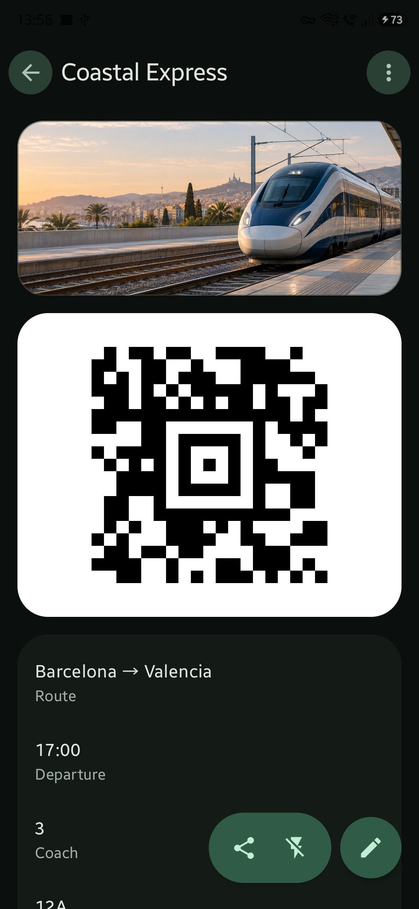
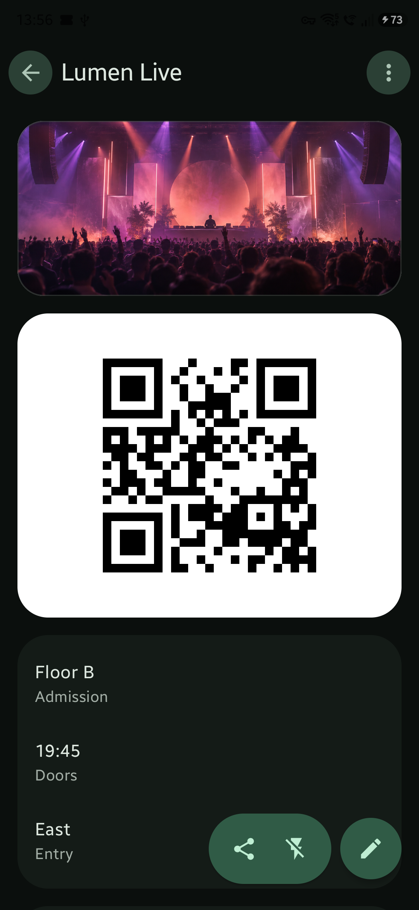
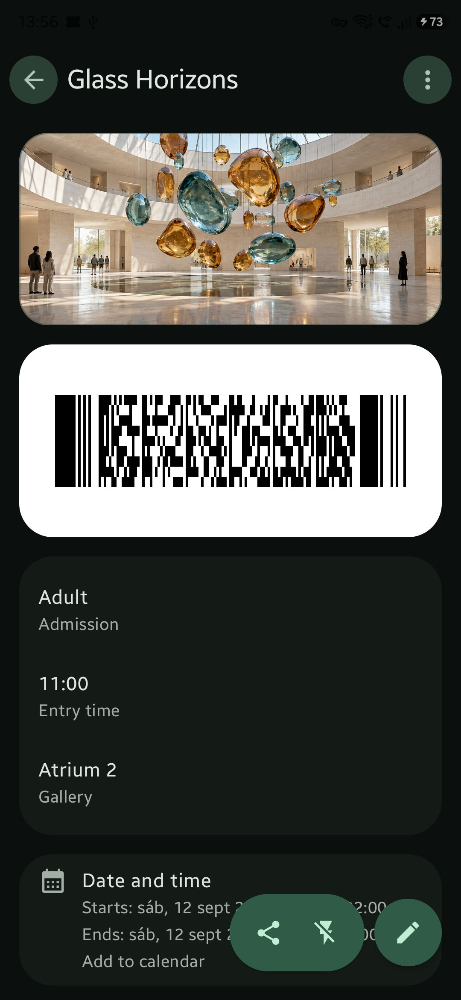

<p align="center">
  
</p>

This repository is an independent modernization of the original [PassAndroid project](https://github.com/ligi/PassAndroid) by ligi and its contributors. It preserves the complete project history, original copyright, and GNU GPL version 3 license.

PassTick is a private, offline-first Android pass wallet. It uses the application ID `dev.lalogo.passtick`. It supports Android 10 and later and does not contain analytics.

## PassTick in use

<table>
  <tr>
    <td align="center"></td>
    <td align="center"></td>
    <td align="center"></td>
  </tr>
  <tr>
    <td align="center"><strong>Travel</strong><br>Aztec code</td>
    <td align="center"><strong>Events</strong><br>QR code</td>
    <td align="center"><strong>Admission</strong><br>PDF417 code</td>
  </tr>
</table>

The examples use fictional passes and original demonstration artwork. The screenshots come from PassTick running on a physical Android device.

## Features

### Pass files

- Import Apple Wallet (`.pkpass`) and esPass (`.esPass`) files from Android document providers or compatible applications.
- Import images and PDF files as local passes.
- Import several files in one operation.
- Create and edit local passes.
- Store all pass data in app-private storage.
- Read common pass fields, dates, locations, images, colors, and barcode formats.
- Keep compatibility with the original PassAndroid pass data.

### Pass display

- Show passes with a Jetpack Compose and Material 3 interface.
- Display QR codes, Aztec codes, PDF417 codes, and supported one-dimensional barcodes.
- Open the code directly from a pass, widget, deep link, or notification.
- Increase screen brightness when a code is open.
- Control the device flashlight from the code view.
- Open pass locations with an installed map application.
- Select another embedded pass image when more than one suitable image is available.
- Choose which sections appear in the full pass view.
- Change the order of full pass sections.

### Home and organization

- Search passes by their visible data.
- Sort passes by newest, oldest, event date, or manual order.
- Reorder passes manually with drag and drop.
- Show passes for today before pinned passes.
- Pin passes to the top of the home screen.
- Archive and restore passes.
- Move deleted passes to Trash and undo the action.
- Permanently delete a pass only after confirmation.
- Create, edit, reorder, and delete tags with custom names, colors, and icons.
- Assign several tags to one pass.
- Filter the home screen by tags, pinned passes, archived passes, protected passes, or all passes.
- Customize the content and order of home cards.

### Timeline and calendar

- Build the Today section, timeline, calendar data, and reminders from the same time-zone-aware event model.
- Show upcoming and active events in chronological order.
- Open a pass from its timeline event.
- Add dated passes to a writable Android calendar.
- Detect when the event already exists in the calendar.
- Optionally offer calendar insertion after import.

### Contextual reminders

- Send reminders before an event, during its access period, and while it is active.
- Update one notification as the event changes phase.
- Remove the notification when the event ends.
- Set global reminder times.
- Disable reminders for one pass, use the defaults, set a custom lead time, or notify at the event time.
- Use exact alarms when Android grants special access and use an inexact alarm otherwise.
- Restore scheduled reminders after a restart, app replacement, time change, or time-zone change.
- Open the pass or its code from a notification.
- Show a Directions action when the pass has a location.
- Show a Snooze action when snoozing is enabled.
- Configure notification actions globally and for each pass.
- Limit sensitive lock-screen content for protected passes.

### Privacy and protection

- Protect one pass or lock all passes with the device credential or supported biometric authentication.
- Keep protected passes in a separate home section.
- Blur protected home cards.
- Show or hide the lock indicator for protected passes.
- Block screenshots and screen recording while protected content is visible.
- Hide sensitive pass details in public lock-screen notifications.
- Process passes locally without analytics or network-dependent pass services.

### Export and sharing

- Export and share the original pass file.
- Export a complete pass, its code, or a custom selection as an image.
- Share exported images through Android.
- Print a pass with the Android print framework.
- Use `content://` URIs and the Storage Access Framework at app boundaries.

### Appearance and system integration

- Use light, dark, or system theme mode.
- Use an optional AMOLED black background.
- Apply the saved theme during a cold start.
- Use automatic screen brightness behavior where applicable.
- Provide a home-screen widget for quick pass access.
- Use a responsive list-detail layout on larger displays.

## Technical design

PassTick uses one Activity, Jetpack Compose, Material 3, Navigation 3, ViewModels, immutable UI state, `StateFlow`, unidirectional data flow, DataStore, and Koin. Domain readers, pass models, sorting, classification, barcode handling, and timeline logic stay separate from Compose.

The maintained source is Kotlin. The project uses JDK 17, Gradle 9.5, AGP 9.3, `compileSdk` 37, `targetSdk` 36, and `minSdk` 29.

## Build

Use JDK 17 and the included Gradle wrapper:

```powershell
.\gradlew.bat :android:testDebugUnitTest :android:lintDebug :android:assembleRelease
```

Run instrumented and Compose tests on API 29 and API 37 when suitable devices are available. Test a release on a physical Android 10 or later device before publication.

## Project relationship

The `upstream` Git remote points to the original [PassAndroid repository](https://github.com/ligi/PassAndroid). PassTick is an independent project. It does not represent the official Play Store, F-Droid, or Amazon releases of PassAndroid. It is not affiliated with Apple.

## License

This project is licensed under the [GNU General Public License version 3](COPYING). Original copyright notices and visible upstream attribution are preserved.
