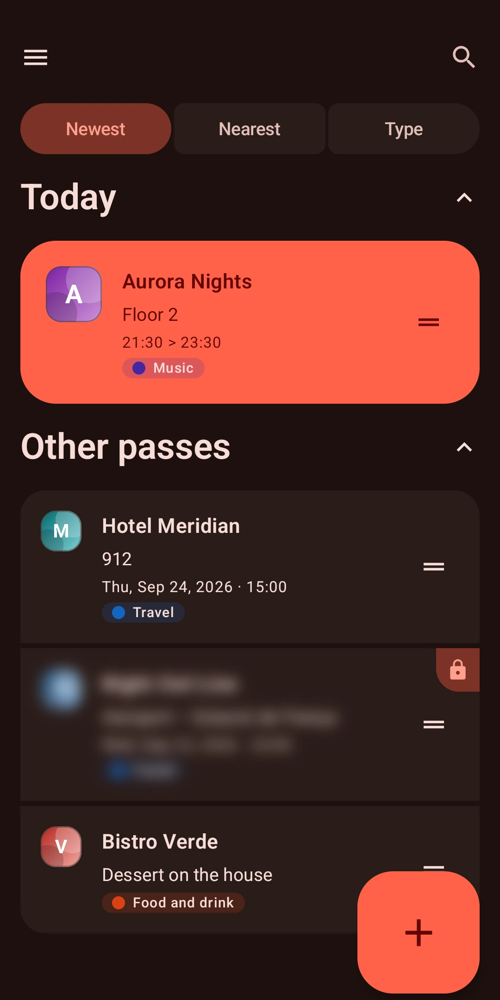
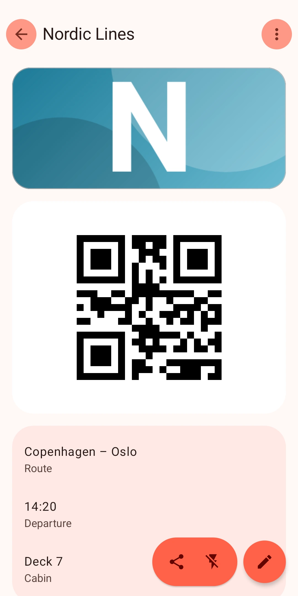
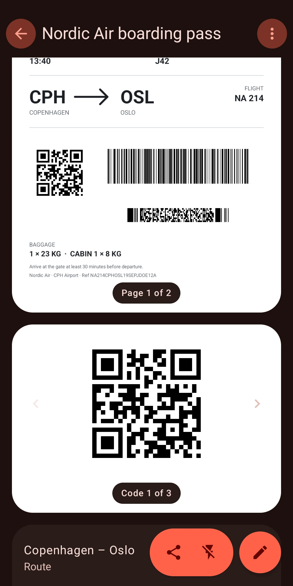
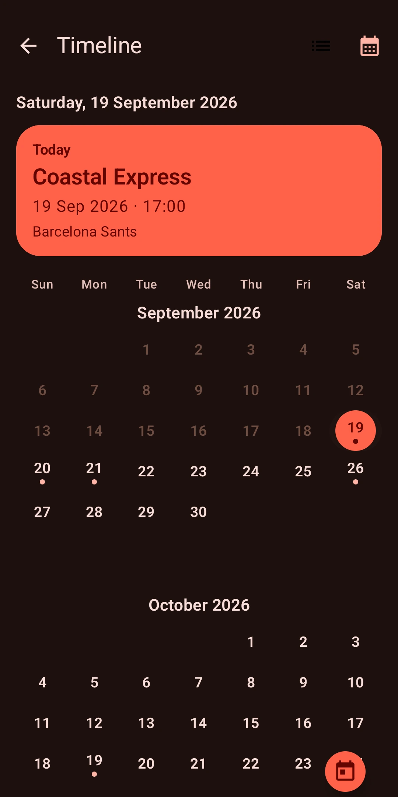
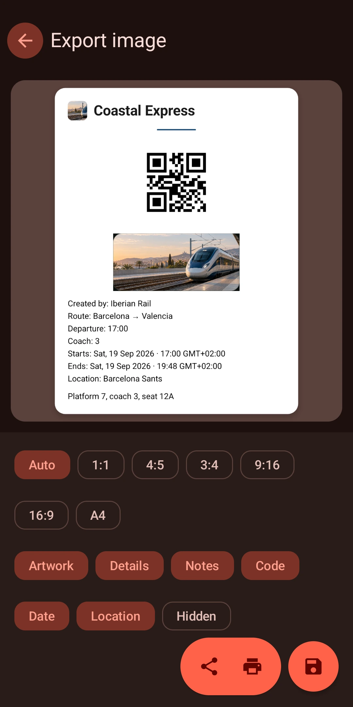
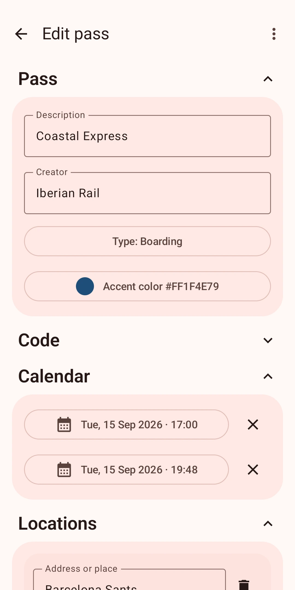

<p align="center">
  
</p>

PassTick is a private, offline-first wallet for Apple Wallet passes on Android. It keeps boarding passes, tickets, and loyalty cards in one place, and turns any PDF or photo into a scannable pass.

This repository is an independent modernization of the original [PassAndroid project](https://github.com/ligi/PassAndroid) by ligi and its contributors. It preserves the complete project history, original copyright, and GNU GPL version 3 license.

<table width="100%">
  <tr>
    <td width="33%" align="center"><br><strong>Home and tags</strong></td>
    <td width="33%" align="center"><br><strong>Pass details</strong></td>
    <td width="33%" align="center"><br><strong>PDF and photo import</strong></td>
  </tr>
  <tr>
    <td width="33%" align="center"><br><strong>Timeline and calendar</strong></td>
    <td width="33%" align="center"><br><strong>Image export</strong></td>
    <td width="33%" align="center"><br><strong>Pass editor</strong></td>
  </tr>
</table>

## Highlights

- **Turn any PDF or photo into a pass.** Pick a PDF, an image, or use the camera. PassTick finds every barcode on every page and suggests a name and color from the document.
- **One document, many codes.** QR, Aztec, PDF417, Data Matrix, Code 39/128, ITF, EAN-8/13. Codes are detected on up to 40 PDF pages, in any orientation, and on inverted colors.
- **Works with what you already have.** `.pkpass`, `.esPass`, images, PDFs, share sheet, "open with", and multi-file import.
- **Everything stays on your device.** No account, no analytics, no network services.
- **Material You, your way.** Dynamic color from your wallpaper, light and dark themes, and an AMOLED black background.
- **One time model for everything.** The Today section, timeline, calendar, and reminders come from the same time-zone-aware events.

## Features

### Import and capture

- Open or share `.pkpass` and `.esPass` files, or import several files in one operation.
- Add PDFs, screenshots, and photos as passes, or capture a pass with the camera.
- Detect every barcode in a document automatically: across PDF pages, in four rotations, and with inverted colors.
- Review before saving: suggested title and accent color, rotate, crop, and select the codes to keep.
- Read the original PDF page by page inside the pass, with zoom.

### Home and organization

- Show passes for today, pinned passes, and recent imports on the home screen.
- Search, sort by newest, oldest, event date, or manual order, and reorder with drag and drop.
- Create tags with custom names, colors, and icons, and filter by tag, pinned, archived, protected, or all passes.
- Archive passes, move deleted passes to Trash with undo, and delete permanently only after confirmation.
- Choose which sections appear on home cards and in the pass view, and their order.

### Codes and actions

- Show all supported barcode formats, and swipe between several codes on one pass.
- Open the code from the pass, the widget, a deep link, or a notification, with increased brightness and an optional flashlight.
- Open pass locations in an installed map app.
- Add an event to a writable calendar and detect when it is already there.

### Timeline and reminders

- Build the Today section, timeline, calendar, and reminders from one time-zone-aware event model.
- Send reminders before, during, and after an event, with global defaults or a per-pass lead time and exact-at-event option.
- Use notification actions to open the pass, open the code, get directions, or snooze.

### Appearance

- Use Material You dynamic color, or pick a manual accent color and color style.
- Switch between light, dark, and system themes, with an optional AMOLED black background.
- Use a responsive list-detail layout on larger displays.

### Privacy

- Process every pass locally. There is no account, no analytics, and no network-dependent pass service.
- Keep pass data and imported documents in app-private storage, and use `content://` URIs and the Storage Access Framework at the app boundaries.
- Protect passes with the device credential or biometrics, and optionally blur protected cards and block screenshots.
- Hide sensitive details in lock-screen notifications.

### Export and sharing

- Share the original pass file.
- Export a pass, its code, or a custom selection as an image.
- Print a pass with the Android print framework.

## Technical design

PassTick uses one Activity, Jetpack Compose, Material 3, Navigation 3, ViewModels, immutable UI state, `StateFlow`, unidirectional data flow, DataStore, and Koin. Domain readers, pass models, sorting, classification, barcode handling, and timeline logic stay separate from Compose.

The maintained source is Kotlin. The project uses JDK 17, Gradle 9.5, AGP 9.3, `compileSdk` 37, `targetSdk` 36, and `minSdk` 29.

## Build

Use JDK 17 and the included Gradle wrapper:

```powershell
.\gradlew.bat :android:testDebugUnitTest :android:lintDebug :android:assembleRelease
```

Run instrumented and Compose tests on API 29 and API 37 when suitable devices are available. Test a release on a physical Android 10 or later device before publication.

## Project relationship

The `upstream` Git remote points to the original [PassAndroid repository](https://github.com/ligi/PassAndroid). PassTick is an independent project. It does not represent the official Play Store, F-Droid, or Amazon releases of PassAndroid. It is not affiliated with Apple.

## License

This project is licensed under the [GNU General Public License version 3](COPYING). Original copyright notices and visible upstream attribution are preserved.
